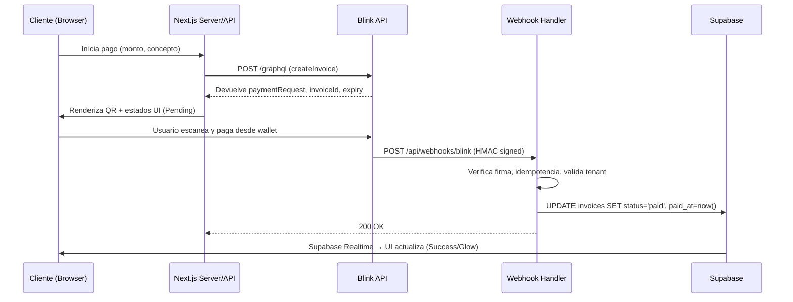

# ⚡ Payment Flow Documentation: Lightning Network via Blink

> Cubre el ciclo de vida completo de una transacción Lightning, desde la generación de invoice hasta la confirmación y actualización UI.  
> **Integración:** Blink API · **Stack:** Next.js App Router · **Estado UI:** Tropical Luxe Design System

## 1. Ciclo de Vida de la Transacción

## 2. Detalles de Implementación

### 2.1. Generación de Invoice (`lib/blink/invoice.ts`)
- Función `createLightningInvoice({ amountSat, memo })`
- Usa GraphQL mutation `lnInvoiceCreate` a través de `graphql-request`
- Manejo de errores y reintentos simples para rate limits/timeouts
- Retorna `paymentRequest` y `expiresAt` para mostrar en UI

### 2.2. Endpoint de Webhook (`app/api/webhooks/blink/route.ts` o similar)
- Valida HMAC-SHA256 de Blink usando `BLINK_WEBHOOK_SECRET`
- Extrae `invoiceId`, `status` (paid/failed), `paid_at`
- Busca invoice en Supabase por `blink_invoice_id` y `tenant_id` (del header o metadata)
- Actualiza estado: `status`, `paid_at`, opcionalmente `lightning_fee`
- Emite actualización en tiempo real mediante Supabase Realtime (channel `invoices`)

### 2.3. Estado de Invoice en Supabase (Tabla `invoices`)
```sql
id UUID DEFAULT uuid_generate_v4() PRIMARY KEY,
tenant_id UUID REFERENCES tenants(id) NOT NULL,
blink_invoice_id TEXT UNIQUE, -- ID provisto por Blink
amount_sat INTEGER NOT NULL,
memo TEXT,
status TEXT CHECK (status IN ('pending', 'paid', 'failed', 'expired')) DEFAULT 'pending',
created_at TIMESTAMPTZ DEFAULT now(),
paid_at TIMESTAMPTZ NULL,
lightning_fee INTEGER NULL, -- fee en satoshis si aplica
qr_code TEXT, -- opcional: almacenar o regenerar
```
### 2.4. Flujo UI (React)
- Al crear invoice: `useState` → `pending`, muestra QR con `qrcode.react`
- Suscripción en tiempo real: `useSupabaseRealtime('invoices')` o similar
- Al cambiar a `paid`: animación de éxito (glow, confeti), opcionalmente mostrar hash de pago
- Manejo de expiración: si `expiresAt` pasado y aún `pending`, cambiar a `expired`

## 3. Consideraciones de Seguridad
- **Idempotencia:** Los webhooks pueden llegar duplicados; filtrar por `blink_invoice_id` y `status` ya procesado.
- **Validación de HMAC:** Rechazar si la firma no coincide.
- **Límites de Tasa:** Blink puede limitar; implementar cola o reintentos con backoff exponencial si es necesario (actualmente retry simple).
- **Variables de Entorno:** 
  - `BLINK_API_KEY` (secreto, solo en server)
  - `BLINK_WEBHOOK_SECRET` (secreto, para validar webhook)
  - `NEXT_PUBLIC_BLINK_GRAPHQL_URL` (endpoint público)

## 4. Casos de Error y Manejo
| Error | Origen | Manejo en UI |
|-------|--------|--------------|
| `rate limit` | Blink API | Reintento automático (ver `invoice.ts`), después mostrar error al usuario |
| `timeout` | Red/Blink | Reintento, luego mensaje de "inténtalo de nuevo" |
| `invalid invoice` | Usuario paga invoice expirado o inválido | Webhook falla, no actualiza DB; UI permanece en `pending` hasta timeout |
| webhook no llega | Configuración de Blink | UI eventualmente muestra `expired` basado en `expiresAt` |
| falta de fondos en wallet | Usuario | Blink nunca confirma pago; UI permanece `pending` hasta expire |

## 5. Métricas y Logging
- Logs en server: invoice creado, webhook recibido (con idempotency key), errores de validación
- Métricas sugeridas (por implementar):
  - Tiempo medio de generación de invoice
  - Tiempo medio entre webhook y pago confirmado
  - Tasa de éxito de pago (invoices pagados vs creados)
  - Número de reintentos por rate limit

## 6. Próximas Mejoras
- [ ] Soporte para Lightning Address (LNURL) como alternativa al QR
- [ ] Pagos divididos (propina al mesero, comisión al restaurante) vía Blink splits
- [ ] Reembolsos automáticos mediante `lnRefundCreate` si aplica
- [ ] Integración con sistema de fidelización (satoshis de vuelta como crédito)
- [ ] WebSocket directo a Blink para eventos en tiempo real (en lugar de polling/webhook hybrid)

> 📖 **Referencias:** `docs/ARCHITECTURE.md` · `lib/blink/invoice.ts` · `app/api/webhooks/blink/route.ts` (ejemplo) · `docs/DESIGN_SYSTEM.md`